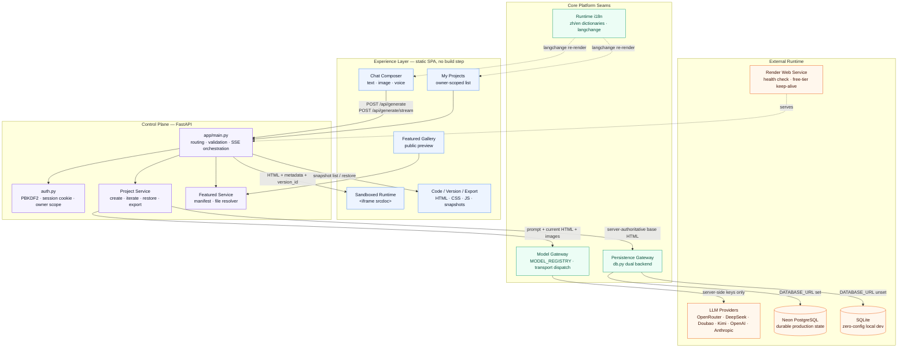
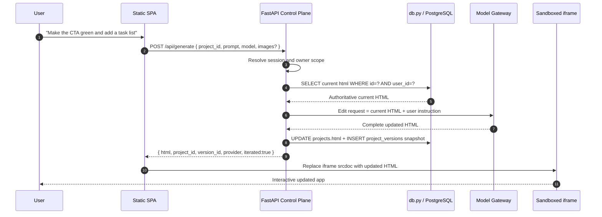

# Atoms Demo

> A mini **AI application builder** with an agent-style loop: describe an app, generate runnable HTML, preview it in a sandbox, then keep chatting to refine the same app in place.

[](https://atoms-demo-lted.onrender.com)
[](https://github.com/eviessun/atoms-demo)

| Entry | Link |
| --- | --- |
| **Live Demo** | https://atoms-demo-lted.onrender.com |
| **Source Code** | https://github.com/eviessun/atoms-demo |
| **Design Deep Dive** | [DESIGN.md](./DESIGN.md) |
| **Submission Notes** | [SUBMISSION.md](./SUBMISSION.md) |
| **中文说明** | [README.zh-CN.md](./README.zh-CN.md) |

Atoms Demo is intentionally small in surface area and complete in product loop. The core path is real end to end: `prompt -> LLM generation -> sandboxed preview -> persisted project -> in-place iteration -> version history -> export`.

## ✨ Key Features & Technical Highlights

| Capability | What is implemented |
| --- | --- |
| **Agentic iteration loop** | Create once, then keep editing the same project through follow-up chat. For logged-in users, the server loads the authoritative current HTML from the database before asking the model to modify it. |
| **Sandboxed live preview** | Generated apps render through `<iframe srcdoc>` with `sandbox="allow-scripts allow-forms allow-modals"`, so generated code can run while remaining isolated from the parent app. |
| **Durable persistence** | Production uses Neon PostgreSQL; local development falls back to SQLite with the same `db.py` function surface. Projects, sessions, idempotency keys, and version snapshots are stored. |
| **Multi-model gateway** | A registry-driven LLM layer supports `mock`, OpenAI-compatible providers, Anthropic, and BYOK. The browser only sends a model id; provider keys never leave the server. |
| **Resilient demo path** | The keyless `mock` model can run the entire workflow with no API key, and real-model failures can degrade to mock instead of breaking the review flow. |
| **SSE streaming** | `/api/generate/stream` streams generation progress and final HTML, while the blocking `/api/generate` endpoint remains available for simpler clients/tests. |
| **Versioned editing** | Every create/iterate/restore appends a version snapshot; rollback is non-destructive and becomes a new version itself. |
| **Multimodal input** | Image attachments are available only for `vision` models with both frontend and backend gates; voice input uses the browser Web Speech API with no backend cost. |
| **Bilingual UX** | Runtime zh/en i18n with localStorage persistence and event-driven re-rendering of dynamic content. |

---

## Architecture

The system is a build-less static SPA backed by a FastAPI control plane. The important architectural choice is that the browser is a renderer and interaction surface, while the server owns identity, model selection, persistence, versioning, and the authoritative base HTML for logged-in iteration.



### Trust Boundaries And Data Flow

1. **Browser boundary:** the SPA owns UI state, staged images, language preference, and sandbox rendering. It never receives provider API keys.
2. **Control-plane boundary:** FastAPI owns auth, ownership checks, idempotency, SSE framing, project lifecycle, and version history.
3. **Model boundary:** `llm.py` translates a generic generate/edit request into provider-specific payloads. The registry determines transport, base URL, model name, key env var, and `vision` capability.
4. **Persistence boundary:** `db.py` hides Postgres/SQLite differences from the rest of the application, including placeholder rewriting and insert-id bridging.

### Deep Dive: The Iteration Loop

The differentiator is not the initial generation; it is the server-authoritative edit loop. Logged-in iteration never trusts client-supplied `base_html`.



**Why this matters:**

- **Server-side truth:** logged-in users cannot forge another project's base HTML or bypass ownership checks.
- **Stable context:** the model receives the full current application, not just a lossy diff.
- **Clean project list:** follow-up edits update the same `project_id`; they do not create duplicate projects.
- **Auditable rollback:** each create/iterate/restore appends a version snapshot, so history remains inspectable.

---

## Tech stack

- **Backend:** FastAPI (Python 3.12), served by uvicorn
- **Frontend:** static HTML/CSS/JS (no build step) — three panels: saved projects · chat · live `<iframe>` preview
- **Persistence:** `psycopg` 3 → PostgreSQL when `DATABASE_URL` is set; stdlib `sqlite3` otherwise
- **Auth:** email + password, PBKDF2-HMAC-SHA256 hashing (stdlib), opaque session token in an httponly cookie
- **LLM layer:** a swappable adapter (`app/llm.py`) driven by a model registry (`app/config.py`); transports: `mock` · OpenAI-compatible · Anthropic
- **Deploy:** Render (web service, free tier) + a GitHub Actions keep-alive ping

No compiled dependencies beyond `pydantic-core` and `psycopg[binary]` (both ship
wheels for Python 3.12 — hence the pinned `.python-version`).

---

## Project layout

```
atoms-demo/
├─ app/
│  ├─ main.py       # FastAPI app: health, models, auth, generate, projects; serves frontend
│  ├─ config.py     # Settings + MODEL_REGISTRY (the selectable models & their key env vars)
│  ├─ llm.py        # swappable LLM adapter: mock / openai-compatible / anthropic; create + edit modes
│  ├─ db.py         # dual-backend persistence: Postgres (DATABASE_URL) or SQLite
│  └─ auth.py       # password hashing + cookie sessions (stdlib only)
├─ static/
│  ├─ index.html    # main app (projects · chat · preview), i18n-tagged
│  ├─ login.html    # dedicated login/register page (tabbed, password reveal)
│  ├─ app.js        # main UI logic (generate, iterate, projects, model picker, image/voice input)
│  ├─ login.js      # login page logic
│  ├─ i18n.js       # zh/en dictionary + runtime translation (shared)
│  └─ style.css / login.css
├─ scripts/
│  └─ test_db_backend.py   # end-to-end DB backend check (users/sessions/projects)
├─ tests/           # pytest suite: auth · generate · ownership · versions · idempotency · images
│  └─ js/           # zero-dependency frontend tests (node --test): image upload · voice · preview
├─ .github/workflows/keep-alive.yml   # pings /api/health so the free instance stays awake
├─ render.yaml      # Render blueprint (Python 3.12, env vars, health check)
├─ .python-version  # 3.12.7 — avoids Python 3.14 wheel/compile issues on Render
├─ requirements.txt
├─ requirements-dev.txt   # + pytest, for running the test suite
├─ .env.example     # single-model quickstart
└─ .env.multi-model.example   # all providers at once
```

---

## Run locally

```bash
python3.12 -m venv .venv
source .venv/bin/activate
pip install -r requirements.txt
uvicorn app.main:app --reload --port 8123
```

Open http://127.0.0.1:8123 . With no `.env`, it uses the keyless `mock` model and
SQLite, so you can register, generate, preview, and iterate immediately — no key,
no database setup.

---

## Tests

A `pytest` suite covers the backend end to end, fully offline (the `mock` model,
a throwaway SQLite file per test — it never touches Neon or the network):

```bash
pip install -r requirements-dev.txt
pytest
```

| Area | What's covered |
| --- | --- |
| **Auth** | register/login/logout, bad email & short password, duplicate email, wrong password, session `me` |
| **Generate** | prompt required, guest gets HTML but nothing persisted, logged-in create persists, iterate-in-place |
| **Ownership** | a user can't read/iterate/list-versions of another user's project (404, no existence leak) |
| **Versions** | history grows on create+iterate, snapshot HTML fetch, **non-destructive rollback** (restore appends) |
| **Idempotency** | same key → one project; different keys → distinct; keyless → legacy; key scoped per user |
| **Images** | `/api/models` exposes `vision`; data-URL sanitizer (filter + cap); content builders (OpenAI/Anthropic shapes); images forwarded only to vision models |

The frontend logic (multimodal input, preview refresh) is covered by a small
zero-dependency suite that runs the real `static/app.js` source through Node's
built-in test runner — no jsdom, no `package.json`:

```bash
node --test          # runs tests/js/*.test.mjs
```

| Area | What's covered |
| --- | --- |
| **Image upload** | `stageImages` type filter · `MAX_IMAGES` cap · oversize/read-error handling; `syncAttachButton` vision gating; `composeBody` sends images only to vision models |
| **Voice input** | `setupVoice` hides the mic when unsupported; recognition lang from i18n; result handler transcribes/appends into the textarea; error handler stays quiet on `aborted`/`no-speech` |
| **Preview** | `showPreview` defers the tab reveal to `requestAnimationFrame` (fixes stale/blank iframe) |

---

## Choosing a model

Instead of one hard-wired provider, the app keeps a **registry** of selectable
models (`MODEL_REGISTRY` in [app/config.py](app/config.py)). The UI shows a
dropdown; **a model only appears if its API key env var is set** (plus the
always-on BYOK entry). The keyless `mock` is `hidden` — kept as a server-side
fallback but never shown as a choice. API keys never leave the server — the
browser sends only a model `id` (e.g. `deepseek-chat`), and the key for that id
is read from the environment on the server.

> Note for reviewers: the public demo is intentionally wired to the **free / low-cost**
> models in the shared environment, so output quality may be less stable than a
> paid frontier model. If you are doing a serious acceptance pass, you can also
> use **BYOK** and point the app at your own paid model for a stronger baseline.

Copy `.env.example` (or `.env.multi-model.example`) to `.env` and fill in only the
providers you want:

```bash
# Free / low-cost, all OpenAI-compatible:
DEEPSEEK_API_KEY=sk-...           # ids: deepseek-chat, deepseek-reasoner
OPENROUTER_API_KEY=sk-or-...      # ids: openrouter-nemotron-free, openrouter-gptoss-free ($0)
MOONSHOT_API_KEY=sk-...           # id: kimi
DOUBAO_API_KEY=...                # id: doubao (Volcano Ark)

# Generic OpenAI-compatible (OpenAI / Groq / local / custom):
OPENAI_API_KEY=sk-...
OPENAI_BASE_URL=https://api.openai.com/v1
OPENAI_MODEL=gpt-4o-mini

# Premium:
ANTHROPIC_API_KEY=sk-ant-...      # id: anthropic

# Which model is selected on first load (optional):
DEFAULT_MODEL_ID=mock
# If the chosen model errors (bad key/quota/network), degrade to mock instead of failing:
LLM_FALLBACK_TO_MOCK=true
```

**Adding a provider** = add one row to `MODEL_REGISTRY` + set its key env var.
Nothing else changes — DeepSeek, Doubao, Kimi, OpenRouter and OpenAI all reuse the
one OpenAI-compatible transport.

---

## Persistence: Postgres or SQLite

[app/db.py](app/db.py) picks the backend at startup from the environment:

- `DATABASE_URL` set → **PostgreSQL** (via `psycopg` 3). Used on Render with a free
  **Neon** database so data survives redeploys/restarts.
- `DATABASE_URL` unset → **SQLite** file (zero-config local dev).

Both backends expose the same functions, so the rest of the app never knows which
is active. Three tables: `users`, `sessions`, `projects`.

> The deployed Render service already has `DATABASE_URL` configured, so production
> data is persisted in Neon PostgreSQL. The SQLite fallback is mainly for local
> development; on Render it would only be used if `DATABASE_URL` were missing, and
> that ephemeral file would be wiped on redeploy.

---

## Deploy to Render (public link)

This repo ships `render.yaml`, so it deploys as a web service on the free tier.

1. Push the repo to GitHub.
2. Render → **New +** → **Web Service** (or **Blueprint** to read `render.yaml`) → connect the repo.
   - Runtime: Python 3.12 · Build: `pip install -r requirements.txt`
   - Start: `uvicorn app.main:app --host 0.0.0.0 --port $PORT` · Health: `/api/health`
3. In **Environment**, add the secrets you need (Render keeps them out of git):
   - `DATABASE_URL` — your Neon connection string (durable persistence)
   - any model API keys, e.g. `OPENROUTER_API_KEY`
   - optionally `DEFAULT_MODEL_ID` (e.g. `openrouter-nemotron-free`)
4. Deploy → you get a public URL like `https://atoms-demo-lted.onrender.com`.

> Render's free instance sleeps after ~15 min idle; the first request then takes
> ~30–60s to wake. `.github/workflows/keep-alive.yml` pings `/api/health` every
> 10 minutes to keep it warm during the review window.

---

## API

| Method | Path | Purpose |
| --- | --- | --- |
| GET | `/api/health` | Liveness + default model id |
| GET | `/api/models` | Selectable models (ids, labels, `vision` flag — never keys) |
| POST | `/api/auth/register` | email + password → sets session cookie |
| POST | `/api/auth/login` | login → sets session cookie |
| POST | `/api/auth/logout` | clears session |
| GET | `/api/auth/me` | current user (or null) |
| POST | `/api/generate` | build a new app, or iterate on one (`project_id` / `base_html`); optional `images` for vision models; create dedupes on optional `idempotency_key` |
| GET | `/api/projects` | current user's saved apps |
| GET | `/api/projects/{id}` | one saved app (owner-scoped) |
| GET | `/api/projects/{id}/versions` | a project's version snapshots (newest first, owner-scoped) |
| GET | `/api/projects/{id}/versions/{vid}` | one snapshot's full HTML (for preview) |
| POST | `/api/projects/{id}/versions/{vid}/restore` | roll back to a snapshot (non-destructive — appended as a new version) |
| GET | `/` , `/login` | frontend pages |

See [DESIGN.md](./DESIGN.md) for request/response shapes and design rationale.

---

## Roadmap

- [x] Runnable skeleton — chat UI + mock generate + live preview
- [x] Auth (register/login/logout) + persistence + "My Projects"
- [x] Dedicated login page + one-click 中/EN i18n
- [x] Dual DB backend — Neon Postgres in prod, SQLite locally
- [x] Iterate loop — refine a generated app via follow-up messages (agent behavior)
- [x] Multi-model dropdown (key-safe), free-model seam + graceful fallback
- [x] Streaming generation (SSE — live reasoning + code as it's written)
- [x] Version history per project + non-destructive rollback
- [x] Export the generated app — download `index.html`, copy source, open in a new tab
- [x] Server-side idempotent create — a retry/replay can't fork a duplicate project
- [x] Multimodal input — image attachments (vision models) + voice-to-text (Web Speech API)
- [x] pytest suite — auth · generate · ownership · versions · idempotency · images (offline)
- [x] Frontend unit tests — image upload · voice · preview via `node --test` (zero-dependency)

## Security notes

- API keys and `DATABASE_URL` live only in the environment (`.env` is gitignored;
  Render keeps secrets in its dashboard) — never committed.
- Passwords hashed with PBKDF2-HMAC-SHA256 (200k rounds); sessions are random
  tokens in httponly + `SameSite=Lax` cookies (Secure when served over HTTPS).
- Project access is **owner-scoped**: every project query filters by `user_id`, so
  you can only read/edit your own apps.
- Generated apps render in a **sandboxed iframe** (`allow-scripts allow-forms
  allow-modals`) — no same-origin access.
