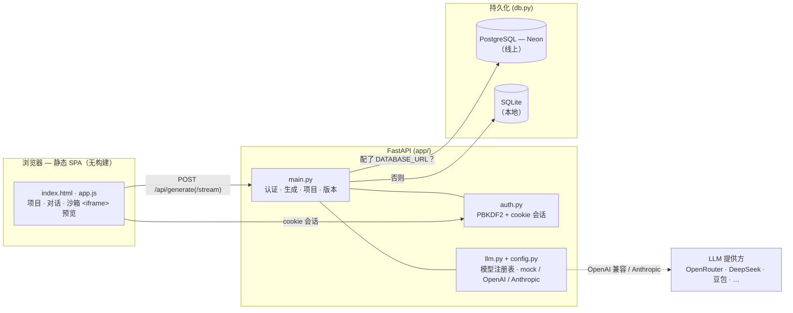

# Atoms Demo（中文说明）

> 🌐 **English version: [README.md](./README.md)** · 架构与设计说明：[DESIGN.md](./DESIGN.md)

一个迷你 **AI 应用生成器**：用自然语言描述一个应用，LLM 生成一个自包含的网页应用，
在沙箱预览里实时渲染 —— 然后你还能继续对话**在原应用上迭代修改**。灵感来自
Atoms / v0 / bolt.new。

- **在线体验：** https://atoms-demo-lted.onrender.com
- **源码仓库：** https://github.com/eviessun/atoms-demo

整条链路（输入需求 → 生成 → 实时预览 → 保存 → 迭代）都是真实可交互的，数据
**持久化在云数据库**，且**无需任何 API key**（内置 keyless 的 `mock` 模型）就能开箱即用。

---

## 亮点（对照笔试硬性要求）

| 要求 | 实现方式 |
| --- | --- |
| **真实交互（非静态）** | 生成后可继续对话细化（"把按钮改成绿色"），模型在当前 HTML 上**原地修改** |
| **数据持久化** | 账号 + 生成的项目存入 **PostgreSQL（Neon）**，跨重启/重新部署不丢；本地自动回退 SQLite |
| **公网链接** | 部署在 Render（免费档）：https://atoms-demo-lted.onrender.com |
| **多模型、密钥安全** | Trae 风格的模型下拉；API key 只留在服务端，浏览器只发送 model id |
| **多模态输入** | 可附带图片（仅 vision 模型，前后端双重门控）+ 浏览器 Web Speech API 语音转文字 |
| **中英文界面** | 全站一键 中 / EN 切换，选择被记住 |
| **零 key 可跑** | keyless `mock` 模型 + 出错优雅回退，线上演示永不硬失败 |

---

## 架构

三栏式单页前端（无构建步骤）对接 FastAPI 后端，后端负责认证、LLM 适配器和双后端
数据存储。同一条生成链路同时提供**阻塞式**接口和 **SSE 流式**孪生接口。



**请求链路 —— 生成 → 持久化 → 迭代：**

1. 浏览器把 prompt POST 到 `/api/generate`（或流式的 `/api/generate/stream`，
   实时展示推理 + 代码）。每次新建都带一个**幂等键**，让重试/重放不会分叉出重复项目。
2. `main.py` 校验并解析归属，`llm.py` 调用所选模型（key 只留服务端；`mock` 无需 key）。
3. 结果通过 `db.py` 存为一个项目 **外加一条 append-only 版本快照**；响应带回 `project_id`。
4. 后续对话在该 `project_id` 上**原地迭代** —— 服务端加载权威的当前 HTML，客户端无法伪造 base。

---

## 技术栈

- **后端：** FastAPI（Python 3.12），uvicorn 运行
- **前端：** 纯静态 HTML/CSS/JS（无构建步骤）—— 三栏：我的项目 · 对话 · 实时 `<iframe>` 预览
- **持久化：** `psycopg` 3 → 配了 `DATABASE_URL` 走 PostgreSQL；否则走标准库 `sqlite3`
- **认证：** 邮箱 + 密码，PBKDF2-HMAC-SHA256 哈希（标准库），会话 token 存 httponly cookie
- **LLM 层：** 可替换适配器（`app/llm.py`），由模型注册表（`app/config.py`）驱动；传输方式：`mock` · OpenAI 兼容 · Anthropic
- **部署：** Render（Web Service，免费档）+ GitHub Actions 定时保活 ping

除 `pydantic-core` 和 `psycopg[binary]` 外无需编译依赖（两者在 Python 3.12 都有预编译
wheel —— 这也是要锁定 `.python-version` 的原因）。

---

## 目录结构

```
atoms-demo/
├─ app/
│  ├─ main.py       # FastAPI：health/models/auth/generate/projects，并托管前端
│  ├─ config.py     # 配置 + MODEL_REGISTRY（可选模型及其 key 环境变量）
│  ├─ llm.py        # 可替换 LLM 适配器：mock / openai 兼容 / anthropic；含新建 + 编辑两种模式
│  ├─ db.py         # 双后端持久化：Postgres（DATABASE_URL）或 SQLite
│  └─ auth.py       # 密码哈希 + cookie 会话（纯标准库）
├─ static/
│  ├─ index.html    # 主应用（项目 · 对话 · 预览），带 i18n 标记
│  ├─ login.html    # 独立登录/注册页（tab 切换、密码显隐）
│  ├─ app.js        # 主界面逻辑（生成、迭代、项目列表、模型选择、图片/语音输入）
│  ├─ login.js      # 登录页逻辑
│  ├─ i18n.js       # 中/英词典 + 运行时翻译（登录页与主页共用）
│  └─ style.css / login.css
├─ scripts/
│  └─ test_db_backend.py   # 数据库后端端到端自检（users/sessions/projects）
├─ tests/           # pytest 测试套件：认证 · 生成 · 权限隔离 · 版本 · 幂等 · 图片
│  └─ js/           # 零依赖前端测试（node --test）：图片上传 · 语音 · 预览
├─ .github/workflows/keep-alive.yml   # 定时 ping /api/health 保活免费实例
├─ render.yaml      # Render 蓝图（Python 3.12、环境变量、健康检查）
├─ .python-version  # 3.12.7 —— 规避 Render 用 Python 3.14 导致的 wheel/编译问题
├─ requirements.txt
├─ requirements-dev.txt   # 额外含 pytest，用于跑测试套件
├─ .env.example     # 单模型快速上手
└─ .env.multi-model.example   # 一次性配置所有 provider
```

---

## 本地运行

```bash
python3.12 -m venv .venv
source .venv/bin/activate
pip install -r requirements.txt
uvicorn app.main:app --reload --port 8123
```

打开 http://127.0.0.1:8123 。没有 `.env` 时默认用 keyless 的 `mock` 模型 + SQLite，
所以你可以立刻注册、生成、预览、迭代 —— 不需要 key，也不用配数据库。

---

## 测试

一套 `pytest` 端到端覆盖后端，全程离线（用 `mock` 模型、每个用例独立的临时 SQLite
文件 —— 绝不碰 Neon，也不走网络）：

```bash
pip install -r requirements-dev.txt
pytest
```

| 范围 | 覆盖内容 |
| --- | --- |
| **认证** | 注册/登录/登出、非法邮箱与短密码、重复邮箱、密码错误、会话 `me` |
| **生成** | prompt 必填、游客拿到 HTML 但不持久化、登录后新建持久化、原地迭代 |
| **权限隔离** | 用户无法读取/迭代/列出他人项目的版本（404，不泄露存在性） |
| **版本** | 新建+迭代后历史增长、快照 HTML 获取、**非破坏性回滚**（回滚追加为新版本） |
| **幂等** | 相同 key → 一个项目；不同 key → 各自独立；无 key → 旧行为；key 按用户隔离 |
| **图片** | `/api/models` 暴露 `vision`；data URL 清洗（过滤 + 限量）；内容构造器（OpenAI/Anthropic 形状）；图片仅转发给 vision 模型 |

前端逻辑（多模态输入、预览刷新）由一套零依赖测试覆盖：直接把 `static/app.js`
的真实源码丢进 Node 内置测试运行器跑，不需要 jsdom，也没有 `package.json`：

```bash
node --test          # 运行 tests/js/*.test.mjs
```

| 范围 | 覆盖内容 |
| --- | --- |
| **图片上传** | `stageImages` 类型过滤 · `MAX_IMAGES` 上限 · 超大/读取失败处理；`syncAttachButton` 按 vision 置灰；`composeBody` 仅向 vision 模型带图 |
| **语音输入** | `setupVoice` 不支持时隐藏麦克风；识别语言随 i18n；result 处理器把转写结果填入/追加到输入框；error 处理器在 `aborted`/`no-speech` 时保持静默 |
| **预览** | `showPreview` 把标签页显示推迟到 `requestAnimationFrame`（修复预览 iframe 空白/陈旧） |

---

## 选择模型（Trae 风格下拉）

不写死单一 provider，而是维护一个可选模型的**注册表**（`app/config.py` 里的
`MODEL_REGISTRY`）。界面显示一个下拉框；**只有配置了对应 API key 环境变量的模型才会出现**
（外加常驻的 BYOK 项）。keyless 的 `mock` 被标记 `hidden`——保留为服务端兜底，但不作为可选项
出现在下拉里。API key 永远不出服务端 —— 浏览器只发送 model `id`
（如 `deepseek-chat`），服务端再根据 id 读取对应的 key。

把 `.env.example`（或 `.env.multi-model.example`）复制成 `.env`，只填你要用的：

```bash
# 免费 / 低成本，均为 OpenAI 兼容：
DEEPSEEK_API_KEY=sk-...           # id: deepseek-chat, deepseek-reasoner
OPENROUTER_API_KEY=sk-or-...      # id: openrouter-nemotron-free, openrouter-gptoss-free（$0）
MOONSHOT_API_KEY=sk-...           # id: kimi
DOUBAO_API_KEY=...                # id: doubao（火山方舟）

# 通用 OpenAI 兼容（OpenAI / Groq / 本地 / 自定义）：
OPENAI_API_KEY=sk-...
OPENAI_BASE_URL=https://api.openai.com/v1
OPENAI_MODEL=gpt-4o-mini

# 高级：
ANTHROPIC_API_KEY=sk-ant-...      # id: anthropic

# 首屏默认选中哪个模型（可选）：
DEFAULT_MODEL_ID=mock
# 选中的模型出错（key 错/额度/网络）时降级到 mock，而不是整个请求失败：
LLM_FALLBACK_TO_MOCK=true
```

**新增一个 provider** = 在 `MODEL_REGISTRY` 加一行 + 设它的 key 环境变量，其余代码不用动 ——
DeepSeek、豆包、Kimi、OpenRouter、OpenAI 都复用同一个 OpenAI 兼容传输实现。

---

## 持久化：Postgres 还是 SQLite

[app/db.py](app/db.py) 在启动时根据环境变量选后端：

- 配了 `DATABASE_URL` → 走 **PostgreSQL**（psycopg 3）。线上在 Render 接免费的
  **Neon** 数据库，数据跨重新部署/重启都在。
- 没配 `DATABASE_URL` → 走 **SQLite** 文件（本地零配置开发）。

两个后端对外暴露完全相同的函数，所以业务代码不需要知道当前用的是哪个。三张表：
`users`、`sessions`、`projects`。

> ⚠️ Render 免费档容器磁盘是临时的，SQLite 数据每次重新部署都会被清空。要持久保存，
> 请在 Render 后台配 `DATABASE_URL`（Neon）。

---

## 部署到 Render（拿公网链接）

仓库自带 `render.yaml`，可直接在免费档部署成一个 Web Service。

1. 把仓库推到 GitHub。
2. Render → **New +** → **Web Service**（或 **Blueprint** 读 `render.yaml`）→ 连接仓库。
   - 运行时：Python 3.12 · 构建：`pip install -r requirements.txt`
   - 启动：`uvicorn app.main:app --host 0.0.0.0 --port $PORT` · 健康检查：`/api/health`
3. 在 **Environment**（环境变量）里加你需要的密钥（Render 会替你保管，不进 git）：
   - `DATABASE_URL` —— 你的 Neon 连接串（持久化）
   - 各模型 API key，如 `OPENROUTER_API_KEY`
   - 可选 `DEFAULT_MODEL_ID`（如 `openrouter-nemotron-free`）
4. 部署完成 → 得到公网链接，如 `https://atoms-demo-lted.onrender.com`。

> Render 免费实例闲置约 15 分钟会休眠，休眠后首个请求要 ~30–60 秒唤醒。
> `.github/workflows/keep-alive.yml` 每 10 分钟 ping 一次 `/api/health`，在评审窗口期保持唤醒。

---

## API 一览

| 方法 | 路径 | 用途 |
| --- | --- | --- |
| GET | `/api/health` | 存活探针 + 默认模型 id |
| GET | `/api/models` | 可选模型列表（id、label、`vision` 标记，绝不含 key） |
| POST | `/api/auth/register` | 邮箱 + 密码注册，下发会话 cookie |
| POST | `/api/auth/login` | 登录，下发会话 cookie |
| POST | `/api/auth/logout` | 退出登录 |
| GET | `/api/auth/me` | 当前用户（或 null） |
| POST | `/api/generate` | 生成新应用，或在已有应用上迭代（`project_id` / `base_html`）；可选 `images` 给 vision 模型；新建按可选 `idempotency_key` 去重 |
| GET | `/api/projects` | 当前用户保存的应用 |
| GET | `/api/projects/{id}` | 单个应用（限本人） |
| GET | `/api/projects/{id}/versions` | 某项目的版本快照（最新在前，限本人） |
| GET | `/api/projects/{id}/versions/{vid}` | 单个快照的完整 HTML（用于预览） |
| POST | `/api/projects/{id}/versions/{vid}/restore` | 回滚到某快照（非破坏性——回滚也追加为新版本） |
| GET | `/` , `/login` | 前端页面 |

请求/响应结构和设计取舍详见 [DESIGN.md](./DESIGN.md)。

---

## 路线图

- [x] 可运行骨架 —— 对话 UI + mock 生成 + 实时预览
- [x] 认证（注册/登录/登出）+ 持久化 + "我的项目"
- [x] 独立登录页 + 一键 中/EN 切换
- [x] 双数据库后端 —— 线上 Neon Postgres，本地 SQLite
- [x] 迭代回路 —— 通过后续对话细化已生成应用（Agent 行为）
- [x] 多模型下拉（密钥安全）、免费模型口子 + 优雅回退
- [x] 流式生成（SSE —— 实时展示推理过程与代码逐字写出）
- [x] 每个项目的版本历史 + 非破坏性回滚
- [x] 导出生成的应用 —— 下载 `index.html`、复制源码、新标签页打开运行
- [x] 服务端幂等新建 —— 重试/重放不会分叉出重复项目
- [x] 多模态输入 —— 图片附件（vision 模型）+ 语音转文字（Web Speech API）
- [x] pytest 测试套件 —— 认证 · 生成 · 权限隔离 · 版本 · 幂等 · 图片（离线）
- [x] 前端单元测试 —— 图片上传 · 语音 · 预览，用 `node --test`（零依赖）

## 安全说明

- API key 和 `DATABASE_URL` 只存在于环境变量里（`.env` 已被 gitignore；Render 在后台
  保管密钥）—— 绝不进仓库。
- 密码用 PBKDF2-HMAC-SHA256（20 万轮）哈希；会话是随机 token，存在 httponly +
  `SameSite=Lax` cookie（HTTPS 下带 Secure 标记）。
- 项目访问**限本人**：每条项目查询都带 `user_id` 过滤，只能读/改自己的应用。
- 生成的应用在**沙箱 iframe**（`allow-scripts allow-forms allow-modals`）中渲染，
  无同源访问权限。
